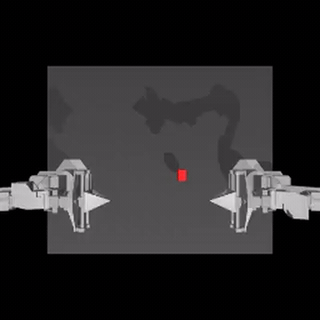
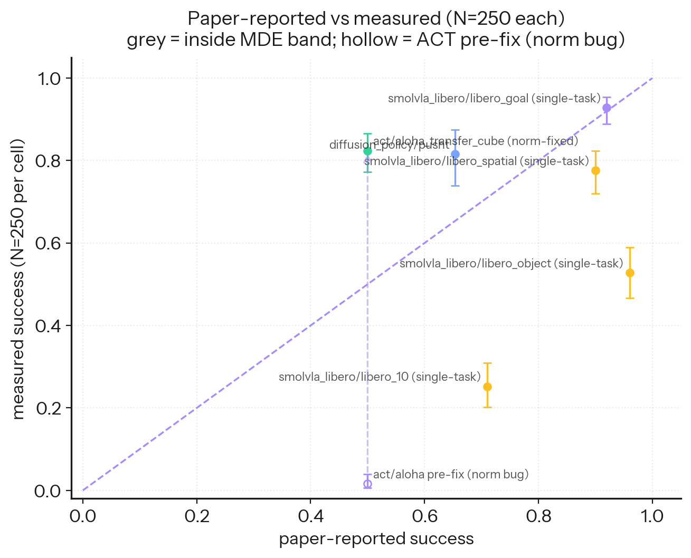

<div align="center">


### One measurement contract for embodied-AI policies, from pretrained models to world-model planners.

A public, reproducible **instrument** that scores every robot-policy paradigm — pretrained imitation, fine-tuning, classical control, world-model planning — as the *same* `obs → action` callable, on shared LeRobot tasks, with Wilson + bootstrap confidence intervals and a hand-labeled failure taxonomy. Its credibility comes from what it caught in its own harness: a normalization bug that pinned ACT × aloha at **0.016**, below the random floor; a clean 2×2 ablation attributes the full **0.016 → 0.824** recovery to the fix. An instrument that audits the auditor.

[](https://github.com/thrmnn/embodimetry/actions/workflows/ci.yml)
[](LICENSE)
[](https://www.python.org/downloads/release/python-3120/)
[](CITATION.cff)
[](https://huggingface.co/datasets/thrmnn/embodimetry-v1)
[](https://huggingface.co/spaces/thrmnn/embodimetry)

**Quick links:** [Get started](docs/GETTING_STARTED.md) · [Reproduce](docs/REPRODUCE.md) · [FAQ](docs/FAQ.md) · [Development](docs/DEVELOPMENT.md) · [Contributing](CONTRIBUTING.md)

</div>

---

<div align="center">

### ▶ Live dashboard — [huggingface.co/spaces/thrmnn/embodimetry](https://huggingface.co/spaces/thrmnn/embodimetry)

The public leaderboard, paired comparisons, rollout browser, and failure taxonomy — no install, no GPU, no login.
Backed by the open dataset [`thrmnn/embodimetry-v1`](https://huggingface.co/datasets/thrmnn/embodimetry-v1): every per-episode outcome and every rollout MP4, queryable by `(policy, env, seed, episode)`.

</div>

---

<div align="center">

<picture>
  
</picture>

<sub>v1 leaderboard — per-cell success rate with Wilson 95% confidence intervals. <a href="https://huggingface.co/spaces/thrmnn/embodimetry">Full interactive leaderboard →</a></sub>

</div>

---

## See it

Real rollouts from v1 — a success and a failure, each scored under the same contract:

<div align="center">

| Diffusion × pusht ✓ | ACT × aloha ✓ | ACT × aloha ✗ |
|:---:|:---:|:---:|
|  |  |  |
| block pushed into the goal | cube transferred between arms | grasp slips — no transfer |

</div>

### The credibility hook: a bug the instrument caught on itself

<div align="center">

<picture>
  
</picture>

<sub>Measured vs. source-paper success rate for each published cell, with 95% CIs. ACT × aloha briefly read <b>0.016</b> — below the random floor — because our harness silently skipped image normalization; a clean 2×2 ablation attributes the full <b>0.016 → 0.824</b> recovery to the fix. The instrument bit on the surface it exists to protect.</sub>

</div>

---

## What it is

Embodimetry measures embodied-AI policies under one auditable eval contract. Every number is a binary-outcome estimate with a confidence interval, anchored to a pinned `lerobot` release and per-policy checkpoint SHAs, and reproducible from a seed triple. v1's public leaderboard measures pretrained policies zero-shot (L0); the same contract already carries up the [capability ladder](#capability-ladder) — fine-tuning, classical control, and a *gated, in-flight* world-model-planning rung — so a controller and a transformer are scored on the same ruler.

The lead is not a leaderboard ranking; it is the self-caught normalization bug (0.016 → 0.824) that shows the instrument bites on the surface it exists to protect.

**Status: v1 finalized** (dataset version `v1.0.2`). Sweep complete — **110 cell-seed runs dispatched, 0 failures** across the published policy × env matrix (a cell is one `(policy, env)` pair). The pi0 family and `xvla_libero` are deferred to v1.1 (see [v1 scope](#v1-scope)).

---

## v1 leaderboard (highlights)

Headline cells, success rate with **Wilson 95% CI**. This is a short highlights view — see the **[full interactive leaderboard](https://huggingface.co/spaces/thrmnn/embodimetry)** for every cell, paired comparison, and failure breakdown.

| Policy | env | N | success | 95% CI |
|---|---|:-:|:-:|:-:|
| **ACT** | aloha_transfer_cube | 250 | **0.824** | [0.772, 0.866] |
| **Diffusion Policy** | pusht | 125† | **0.816** | [0.739, 0.874] |
| **SmolVLA** | libero_goal | 250 | **0.928** | [0.889, 0.954] |
| **SmolVLA** | libero_spatial | 250 | 0.776 | [0.720, 0.823] |
| **SmolVLA** | libero_object | 250 | 0.528 | [0.466, 0.589] |
| **SmolVLA** | libero_10 | 250 | 0.252 | [0.202, 0.309] |

<sub>† `diffusion_policy × pusht` auto-downscoped to N=125 (25 ep/seed) after calibration flagged slow inference. `no_op` and `random` baselines run on every env as the floor.</sub>

Two honesty notes the leaderboard surfaces — both are **reproducibility proof-points, not the thesis**:

- **ACT × aloha is honest about a bench-side bug we caught.** The release briefly read `0.016`; that was a **normalization bug on our end** — our harness silently skipped dataset normalization on the image observation, feeding ACT un-normalized images. Fixed, the same checkpoint reads **0.824**. A 2×2 ablation (norm {buggy, fixed} × inference {Hub-default, paper}) reads buggy = 0.016 / 0.016 and fixed = **0.812** / **0.768** — the recovery is 100% the normalization fix and temporal ensembling is a wash.
- **SmolVLA × libero_10 = 0.252 is a single-task probe, not the paper's 10-task average.** Real for that scope, a lower bound at our step cap; v1.1 closes both caveats.

Full audit and per-policy "paper vs. measured" notes live in the [methodology docs](docs/DESIGN.md) and [`docs/MODEL_CARDS.md`](docs/MODEL_CARDS.md).

---

## Quickstart

**60 seconds, no GPU, no download.** A fresh clone ships a tiny committed view of the leaderboard headline cells. Read a real number with a confidence interval before installing anything heavy:

```bash
git clone https://github.com/thrmnn/embodimetry.git && cd embodimetry
pip install -e .                       # core deps only (pandas + scipy)
python examples/read_results.py        # prints the v1 leaderboard with Wilson 95% CIs
```

That reads `examples/results-mini.parquet` and prints `act × aloha 0.824 [0.772, 0.866]`, the four SmolVLA × LIBERO cells, and `diffusion × pusht` — each with its confidence interval. No GPU, no Hub download.

**Want to reproduce a number on a GPU, or run the full sweep?** That path (conda env, CUDA expectations, single-cell run, overnight sweep) lives in the developer docs:

> **→ [`docs/DEVELOPMENT.md`](docs/DEVELOPMENT.md)** — the dev/contributor front door · **[`docs/GETTING_STARTED.md`](docs/GETTING_STARTED.md)** — first GPU run · **[`docs/REPRODUCE.md`](docs/REPRODUCE.md)** — reproduce a published cell.

---

## v1 scope

Published policy × env matrix — **5 leaderboard policies (+ `xvla` executed-but-deferred) × 6 envs**, **110 cell-seed runs dispatched, 0 failures**:

| | pusht | aloha_transfer_cube | libero_spatial | libero_object | libero_goal | libero_10 |
|---|:-:|:-:|:-:|:-:|:-:|:-:|
| `no_op` | ✓ | ✓ | ✓ | ✓ | ✓ | ✓ |
| `random` | ✓ | ✓ | ✓ | ✓ | ✓ | ✓ |
| `diffusion_policy` | ✓ | | | | | |
| `act` | | ✓ | | | | |
| `smolvla_libero` | | | ✓ | ✓ | ✓ | ✓ |
| `xvla_libero` | | | 🅓 | 🅓 | 🅓 | 🅓 |

Legend: ✓ runnable cell in the v1 leaderboard · 🅓 cell *executed* in the sweep but **deferred from the leaderboard** (upstream Hub-artifact wiring bugs). See [`docs/DEFERRED_POLICIES.md`](docs/DEFERRED_POLICIES.md).

**5 seeds × 50 episodes per cell** (N=250 binary outcomes), with two cells auto-downscoped to 25 ep/seed (N=125) after calibration flagged slow inference. The Pi0 family is **deferred to v1.1** — it overflows the host RAM budget during cold checkpoint load; see [`docs/DEFERRED_POLICIES.md`](docs/DEFERRED_POLICIES.md).

---

## Capability ladder

v1 is the bottom rung. The point of an *instrument* rather than a one-off benchmark is that the same eval contract — `act(obs) -> action`, scored with the same statistics — carries all the way up:

<div align="center">


</div>

The rungs below the in-flight one are **measured and honest about their negatives** — that is the spine that earns the instrument its credibility:

- **L0 — pretrained, zero-shot** _(shipped, v1 leaderboard)_: Diffusion Policy × PushT **0.816** [0.739, 0.874]; ACT × aloha **0.824** [0.772, 0.866]; the four SmolVLA × LIBERO cells (0.252–0.928).
- **L1 — fine-tune** _(measured, off-leaderboard)_: continuing to fine-tune the already-converged ACT moves 0.824 → 0.864, a **+0.040 shift whose CIs overlap** (below the N=250 MDE) — reported as within noise, not an improvement. An attempted SmolVLA LoRA fine-tune **collapses** (a data-wiring bug the closed-loop number caught while every offline metric smiled).
- **L2 — classical control** _(measured, off-leaderboard)_: a competent scripted PushT controller reaches ~0.50 mean coverage but clears the strict success bar only **0.012** [0.004, 0.035] of the time — learning buys the last fraction of precision.
- **L3 — world-model MPC** _(in-flight hypothesis, gated off the leaderboard)_: a *hypothesis*, not a result. Under matched receding-horizon MPC, a zero-training latent planner solves navigation but **not** contact (PushT ~0), a two-endpoint contrast (N=6 per cell, one env per endpoint) — it is not a cross-env law and not a measured curve. It runs in a [separate research repo](docs/WM_RESEARCH_TRACK.md) and is never quoted as a finding.
- **L4 — RL + guarantees** _(vision)_: the bridge from learning to provable control.

The world-model track does **not** touch the production leaderboard; the only write-path is a gated adapter PR, held off the board until a planner is explicitly promoted. Full write-up: [`docs/blog/capability-ladder-audit.md`](docs/blog/capability-ladder-audit.md); two-speed model in [`docs/TWO_SPEED.md`](docs/TWO_SPEED.md).

---

## Methodology in one paragraph

Each cell reports a **per-episode binary success** rate over 5 seeds × 50 episodes (N=250), with a **Wilson 95% confidence interval** on the pooled rate; distributional summaries and paired deltas use a stratified bootstrap. Per-cell determinism comes from a `(env_seed, action_seed, policy_seed)` triple derived from the cell's seed index, so re-running `(policy, env, seed=k)` reproduces the exact parquet rows. Every leaderboard row is anchored to the pinned **`lerobot==0.5.1`** release and a per-policy checkpoint SHA. Headline deltas are cited only where `|delta| > MDE` (the minimum detectable effect at N=250).

**Deeper:** [`docs/DESIGN.md`](docs/DESIGN.md) (full methodology + seeding contract) · [`docs/MDE_TABLE.md`](docs/MDE_TABLE.md) (MDE math) · [`docs/FAILURE_TAXONOMY.md`](docs/FAILURE_TAXONOMY.md) (failure labels) · [`docs/REPRODUCE.md`](docs/REPRODUCE.md) (reproduce a published cell).

---

## What's next

**v1.1 — expanded LIBERO coverage** (10 tasks per suite) ships as a **new dataset version `embodimetry-v1.1`**, closing the SmolVLA single-task scope caveat with proper 10-task suite averages. It is upcoming; no v1.1 numbers are published yet. Further roadmap (xvla re-enable, pi-family streaming load, bring-your-own-env, sim-to-real bridge) is in [`docs/PIPELINE_ROADMAP.md`](docs/PIPELINE_ROADMAP.md). Adding a new sim env is a documented contribution path — see [`docs/ENV_CONTRIBUTION_GUIDE.md`](docs/ENV_CONTRIBUTION_GUIDE.md).

---

## Documentation

| | |
|---|---|
| **Get started** (first GPU run) | [`docs/GETTING_STARTED.md`](docs/GETTING_STARTED.md) |
| **Reproduce** a published cell | [`docs/REPRODUCE.md`](docs/REPRODUCE.md) |
| **FAQ** | [`docs/FAQ.md`](docs/FAQ.md) |
| **Development** (dev/contributor hub) | [`docs/DEVELOPMENT.md`](docs/DEVELOPMENT.md) |
| **Contributing** | [`CONTRIBUTING.md`](CONTRIBUTING.md) |
| **License** | [`LICENSE`](LICENSE) (MIT) |
| **Citation** | [`CITATION.cff`](CITATION.cff) |

---

## License

MIT. See [LICENSE](LICENSE).

## Citation

The arxiv writeup pre-print lands alongside the dataset upload. Until the arXiv ID is assigned, cite this repository using [`CITATION.cff`](CITATION.cff) (GitHub's "Cite this repository" widget reads it directly).
<!-- TODO: add the arxiv BibTeX entry here once the ID is assigned (dataset is live at huggingface.co/datasets/thrmnn/embodimetry-v1). -->
